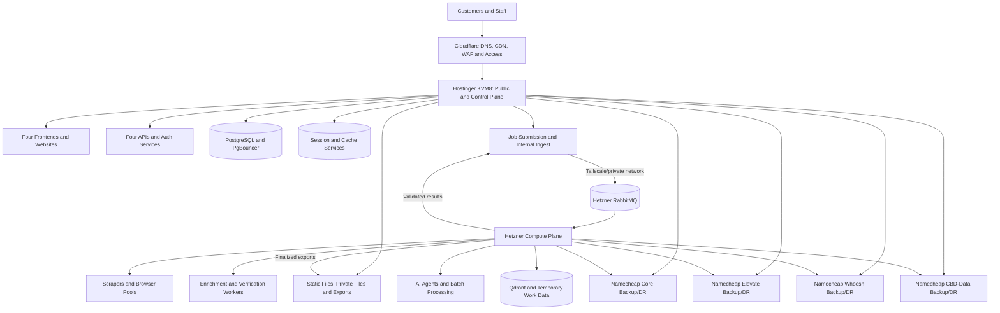
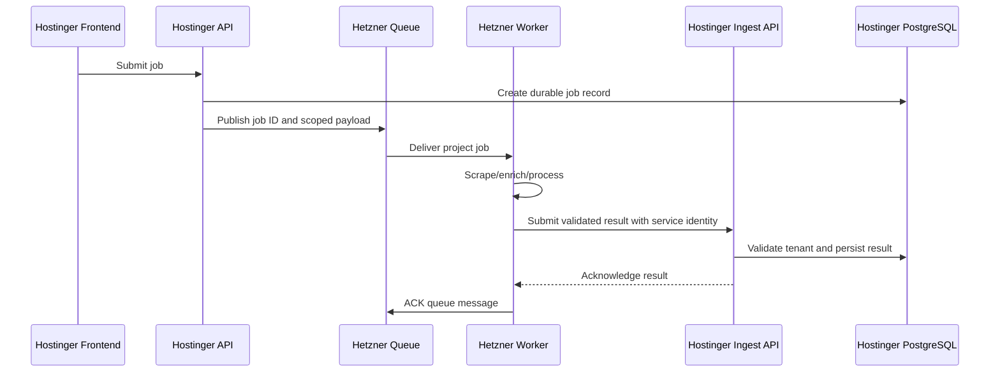
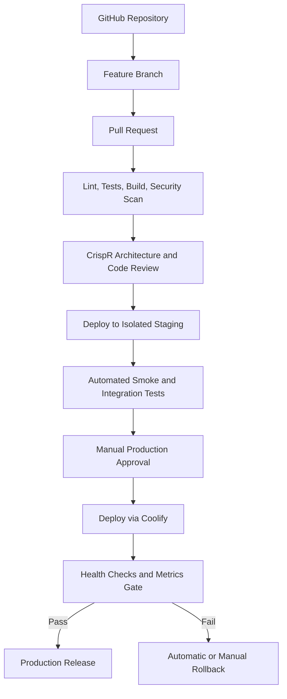

# Brandon Multi-Project Infrastructure PRD v3.0

**Client:** Brandon  
**Prepared for:** CrispR / Dubz and the HD2 agent swarm  
**Architecture owners:** Eric and Dubz  
**Implementation support:** Saad and approved HD2 implementation agents  
**Status:** Approved architecture direction; implementation requires inventory validation  
**Last updated:** August 4, 2026  

---

## 0. Executive Directive

HD2 will deploy and operate Brandon's four projects across infrastructure that has already been purchased:

- One Hostinger KVM8 VPS
- One Hetzner dedicated server
- Four small Namecheap servers/accounts

The architecture must use the existing assets efficiently rather than purchasing unnecessary replacement infrastructure.

The required division of responsibility is:

- **Hostinger KVM8:** public websites, frontend applications, public and internal APIs, authentication, customer dashboards, file delivery, finalized exports, primary application control plane, and shared management services.
- **Hetzner dedicated server:** scraping, browser automation, enrichment, AI-agent execution, background jobs, compute-heavy transformations, queue consumers, temporary working data, and other high-load processing.
- **Four Namecheap servers/accounts:** one backup and disaster-recovery target per project. Each Namecheap target must remain isolated from the other projects.

The four projects are:

1. [Core Distro](https://www.core-distro.com)
2. [Elevate Life Sci](https://www.elevatelifesci.com)
3. [Whoosh Performance](https://www.whooshperformance.com)
4. [CBD-Data](https://www.cbd-data.com)

No Kubernetes is required for this design. The approved orchestration model is Docker, Docker Compose, Coolify, GitHub-based CI/CD, Tailscale, Cloudflare, and documented recovery procedures.

Coolify is a deployment interface, not the source of truth. Every service must remain reproducible from version-controlled configuration even if Coolify is unavailable.

---

## 1. Purpose

This PRD defines the complete target architecture, project isolation model, agent responsibilities, rollout order, security controls, deployment gates, monitoring requirements, backup design, disaster-recovery model, and acceptance criteria for Brandon's infrastructure.

It is written for CrispR and the HD2 agent swarm. The swarm is expected to convert this PRD into:

- Audited infrastructure inventory
- Version-controlled configuration
- Docker Compose definitions
- Coolify resources
- Network and firewall rules
- Deployment pipelines
- Backup jobs
- Restore tests
- Monitoring dashboards
- Runbooks
- Evidence packs
- Final handoff documentation

The swarm must not silently alter the approved architecture. Any deviation must be recorded as an architecture decision record and approved by Eric and Dubz before implementation.

---

## 2. Business and Project Context

### 2.1 Core Distro

**Domain:** `www.core-distro.com`  
**Project code:** `core`  
**Known positioning:** pharmaceutical and laboratory supply/distribution, including product inquiries, quotes, partnerships, vials, bottles, caps, laboratory plastics, and packaging.

Expected application patterns may include:

- Public marketing and product-catalog pages
- Quote and partnership inquiry forms
- Internal lead and account dashboards
- Product or supplier records
- Customer and prospect data
- File uploads and downloadable product documents
- Background research and lead enrichment
- CRM or workflow integrations

The infrastructure must not assume that Core Distro processes protected health information. If PHI, prescription data, or regulated patient data is later introduced, the project must stop and receive a separate compliance and security architecture review.

### 2.2 Elevate Life Sci

**Domain:** `www.elevatelifesci.com`  
**Project code:** `elevate`

The exact application requirements are not yet proven by the materials available to this PRD. CrispR must treat this as a discovery-gated life-sciences project and must not invent product, patient, clinical, or compliance requirements.

Until discovery is complete, assume only:

- Public website and frontend
- Potential authenticated portal
- Potential lead, company, product, or partner data
- Potential files and reports
- Potential background enrichment or research work

No PHI, clinical records, prescription data, or payment-card data may be introduced without a separate approved data-classification decision.

### 2.3 Whoosh Performance

**Domain:** `www.whooshperformance.com`  
**Project code:** `whoosh`

Whoosh Performance must be treated as a distinct project. It must not inherit assumptions from any differently named Whoosh project or prior Whoosh Wellness documentation.

The exact application functions require discovery. Until then, provision a standard isolated web, API, file, queue, worker, backup, and monitoring pattern, but enable only the components proven necessary by the code and product review.

### 2.4 CBD-Data

**Domain:** `www.cbd-data.com`  
**Project code:** `cbddata`

Known application functions include:

- B2B business search by keyword and location
- Automated website visits and data acquisition
- Email, phone, social-profile, and contact enrichment
- Lead-list management
- CSV export
- Public share links
- CRM integration
- API access for larger plans

CBD-Data is expected to generate the heaviest scraping, enrichment, queue, export, and data-volume workload of the four projects. Its public application remains on Hostinger, while its scraping, enrichment, AI, and batch-processing workloads run on Hetzner.

---

## 3. Goals

### 3.1 Primary Goals

- Use the infrastructure Brandon already owns.
- Keep public-facing services responsive while heavy jobs are running.
- Isolate all four projects at the network, credential, data, queue, file, logging, and backup layers.
- Make every deployment repeatable and reversible.
- Prevent a failure in one project from taking down the other projects.
- Prevent scraping or enrichment spikes from degrading customer-facing websites.
- Make backup and recovery measurable rather than assumed.
- Give CrispR a controlled agent-swarm workflow with human approval gates.
- Keep the architecture understandable enough for Eric, Dubz, Saad, and future HD2 engineers to operate.
- Avoid Kubernetes and avoid unnecessary infrastructure complexity.

### 3.2 Success Definition

The platform is successful when:

- All four public projects can operate on Hostinger without depending on Hetzner for basic page delivery.
- New background jobs can be submitted even when Hetzner workers are temporarily offline.
- Hetzner can process project-specific queues without accessing unrelated project data.
- Each project has its own Namecheap backup destination.
- A complete project can be restored from documented backups.
- Every production change can be traced to a Git commit and approval.
- Every critical service has health checks, alerts, resource limits, logs, and a rollback path.

---

## 4. Non-Goals

The following are not part of this rollout unless separately approved:

- Kubernetes or multi-node Kubernetes clusters
- Automatic cross-region active-active deployment
- Unreviewed migration of existing production data
- Redesign of the four websites
- Replacement of working application frameworks without a documented reason
- Direct public exposure of PostgreSQL, Redis, RabbitMQ, Qdrant, Coolify, Grafana, or internal admin tools
- Use of Namecheap shared hosting as if it were guaranteed Docker compute
- Automatic production database migrations without a rollback or restore point
- Storing secrets in Git, Docker images, plaintext backups, agent memory, logs, or issue comments
- Sharing one unrestricted database user, queue user, API key, or backup credential across all projects
- Allowing agents to change DNS, delete data, rotate production secrets, or destroy infrastructure without human approval

---

## 5. Mandatory Discovery Gates

No production rollout begins until the following gates are completed.

### Gate A — Server Inventory

Record the actual specifications of every server:

- Provider and account identifier
- Public IP
- Region/datacenter
- CPU model and core count
- RAM
- Disk type, size, and free capacity
- Operating system
- Filesystem
- Network limits
- Backup or snapshot features
- Existing services
- Existing firewall rules
- Existing Docker version
- Existing Coolify version and state
- Existing domains and DNS records

### Gate B — Namecheap Capability Classification

Each of the four Namecheap services must be classified as one of:

1. **VPS-capable DR node**
   - Root or sudo access
   - Docker supported
   - Tailscale supported
   - Persistent processes supported
   - Custom firewall supported

2. **Shared/cPanel backup target**
   - No Docker assumption
   - No Tailscale assumption
   - SFTP/SSH, FTP, or file-manager access only
   - May host a static maintenance page
   - Used for encrypted backup storage and cold recovery, not live failover

3. **Unsuitable for protected backups**
   - No secure transfer
   - Insufficient storage
   - No reliable retention
   - No usable restore path

If a Namecheap service is in category 3, the swarm must stop that project's backup rollout and report the limitation. It must not silently place unencrypted data there.

### Gate C — Application Audit

For each project, record:

- Repository
- Default and production branches
- Framework and runtime
- Build process
- Required services
- Required environment variables
- Database engine and schema tool
- File-storage behavior
- Scheduled jobs
- Queue requirements
- Browser or scraping requirements
- External API dependencies
- Email/SMS integrations
- Authentication model
- Current deployment process
- Health endpoint availability
- Data sensitivity
- Current traffic and expected load

### Gate D — Data Classification

Every persistent data set must be labeled:

- **Public:** intended for unrestricted publication
- **Internal:** operational data with low sensitivity
- **Confidential:** customer, supplier, lead, pricing, or business data
- **Restricted:** credentials, secrets, identity documents, regulated data, or other high-impact records

Restricted data requires explicit approval and additional controls. PHI and payment-card data are prohibited unless a separate architecture is approved.

### Gate E — Ownership and Access

List every human and machine identity with:

- Name
- Role
- Required access
- Authentication method
- Expiration or review date
- Approver

No generic shared admin account is permitted except emergency break-glass access stored in the approved password manager and audited after use.

---

## 6. Target Architecture

### 6.1 High-Level Architecture



### 6.2 Failure Behavior

#### If Hetzner fails

- Public websites remain online.
- Authentication and customer dashboards remain available if their required data services are on Hostinger.
- New heavy jobs are accepted only if the queue submission path is available; otherwise they are placed into a durable pending state on Hostinger.
- Existing heavy jobs pause.
- Users receive a truthful status such as `Queued`, `Processing delayed`, or `Compute maintenance`.
- No job is silently lost.

#### If Hostinger fails

- Public websites and application APIs are unavailable until Hostinger is restored or a replacement environment is activated.
- Hetzner workers stop accepting new work and finish, pause, or safely checkpoint current work according to job type.
- No worker writes directly to a missing primary database without retry limits.
- Cloudflare may serve cached public static content where appropriate.
- Recovery uses Hostinger backups stored on the assigned Namecheap targets plus the version-controlled deployment definitions.

#### If one project fails

- The other three projects continue operating.
- Project-specific networks, containers, credentials, databases, queues, files, and backups prevent lateral impact.

#### If a Namecheap target fails

- Production continues.
- Alerts fire for backup age and failed transfer.
- Local short-retention backups remain available while the backup destination is repaired.
- The failed project is marked as not meeting DR requirements until backup redundancy is restored.

---

## 7. Server Roles

## 7.1 Hostinger KVM8 — Public and Control Plane

**Proposed hostname:** `bdn-edge-01`  
**Purpose:** all customer-facing delivery and shared control-plane services.

### Required Responsibilities

- Reverse proxy
- TLS origin termination
- Public frontend containers
- Public APIs
- Internal ingest APIs
- Authentication and authorization
- Customer and staff dashboards
- Static asset delivery
- Private file and export delivery
- Primary application database services unless the code audit proves another approved design
- Database connection pooling
- Session and cache services
- Job-submission persistence
- Finalized export storage
- Central deployment target for public services
- Central metrics dashboards and uptime checks, within a controlled resource budget

### Prohibited Responsibilities

- Large Playwright browser pools
- High-concurrency scraping
- Large enrichment batches
- Bulk AI-agent execution
- Unbounded worker processes
- Raw scrape artifact accumulation
- Long-running CPU-intensive transformations
- Publicly exposed internal infrastructure ports

### Recommended Service Layout

```text
/opt/brandon/
├── shared/
│   ├── reverse-proxy/
│   ├── coolify-agent/
│   ├── postgres/
│   ├── pgbouncer/
│   ├── monitoring/
│   ├── logging/
│   └── scripts/
├── core/
│   ├── web/
│   ├── api/
│   ├── ingest/
│   ├── files/
│   └── cache/
├── elevate/
│   ├── web/
│   ├── api/
│   ├── ingest/
│   ├── files/
│   └── cache/
├── whoosh/
│   ├── web/
│   ├── api/
│   ├── ingest/
│   ├── files/
│   └── cache/
└── cbddata/
    ├── web/
    ├── api/
    ├── ingest/
    ├── files/
    └── cache/
```

### Public Domain Routing

| Project | Primary domain | Project code | Frontend service | API service | Files namespace |
|---|---|---:|---|---|---|
| Core Distro | `www.core-distro.com` | `core` | `core-web` | `core-api` | `core-files` |
| Elevate Life Sci | `www.elevatelifesci.com` | `elevate` | `elevate-web` | `elevate-api` | `elevate-files` |
| Whoosh Performance | `www.whooshperformance.com` | `whoosh` | `whoosh-web` | `whoosh-api` | `whoosh-files` |
| CBD-Data | `www.cbd-data.com` | `cbddata` | `cbddata-web` | `cbddata-api` | `cbddata-files` |

Reserve, but do not create until required:

- `api.<domain>`
- `app.<domain>`
- `files.<domain>`
- `admin.<domain>`
- `staging.<domain>`
- `status.<domain>`

Admin and staging endpoints must be protected by Tailscale or Cloudflare Access and must never be publicly open merely because DNS exists.

---

## 7.2 Hetzner Dedicated Server — Compute Plane

**Existing hostname:** retain `brandon-prod` if already configured, or document an approved change to `bdn-compute-01`.  
**Purpose:** high-load compute, queues, browser automation, enrichment, AI execution, temporary processing data, and worker observability.

### Existing Foundation to Preserve

Where already installed and verified, preserve rather than rebuild:

- Ubuntu Server 24.04 LTS
- Docker Engine
- Docker Compose
- UFW
- Tailscale
- Coolify
- Standardized `/opt` structure
- Prepared PostgreSQL, Redis, RabbitMQ, Qdrant, and Metabase configurations

Do not enable prepared services solely because they exist. Enable only services required by the audited applications.

### Coolify Position

The existing Coolify instance on Hetzner may remain the single management panel and may register Hostinger as a remote deployment target.

Requirements:

- Coolify UI available only over Tailscale or Cloudflare Access.
- Coolify is not required for application runtime.
- All deployable services have version-controlled Docker Compose or equivalent definitions.
- A Coolify outage must not stop running applications.
- A Coolify outage must not prevent emergency CLI deployment using the runbook.
- Coolify database and configuration are backed up separately.

### Compute Service Layout

```text
/opt/brandon/
├── shared/
│   ├── coolify/
│   ├── rabbitmq/
│   ├── qdrant/
│   ├── browser-base/
│   ├── monitoring/
│   ├── logging/
│   └── scripts/
├── core/
│   ├── scraper/
│   ├── enrichment/
│   ├── ai-workers/
│   ├── scheduled-jobs/
│   └── workspace/
├── elevate/
│   ├── scraper/
│   ├── enrichment/
│   ├── ai-workers/
│   ├── scheduled-jobs/
│   └── workspace/
├── whoosh/
│   ├── scraper/
│   ├── enrichment/
│   ├── ai-workers/
│   ├── scheduled-jobs/
│   └── workspace/
└── cbddata/
    ├── scraper/
    ├── enrichment/
    ├── verification/
    ├── ai-workers/
    ├── export-workers/
    ├── scheduled-jobs/
    └── workspace/
```

### RabbitMQ Isolation

Use one RabbitMQ cluster or instance with separate virtual hosts:

- `/core`
- `/elevate`
- `/whoosh`
- `/cbddata`

Each virtual host receives project-specific users, exchanges, queues, permissions, rate policies, and dead-letter queues.

No worker credential may access more than one project virtual host unless the exception is documented and approved.

Recommended queue naming:

```text
<project>.scrape.jobs
<project>.enrich.jobs
<project>.verify.jobs
<project>.ai.jobs
<project>.export.jobs
<project>.scheduled.jobs
<project>.deadletter
```

### Qdrant Isolation

If Qdrant is required:

- Use project-prefixed collections.
- Use separate API credentials where supported.
- Store collection ownership and embedding model metadata.
- Never mix embeddings from different projects in an unscoped collection.
- Snapshot each project separately.
- Track schema and embedding-version compatibility.

Suggested collection names:

```text
core_<dataset>_<embedding_version>
elevate_<dataset>_<embedding_version>
whoosh_<dataset>_<embedding_version>
cbddata_<dataset>_<embedding_version>
```

### Browser Pool Isolation

- Browser pools must be assigned per project or tagged with a mandatory tenant identifier.
- Use hard concurrency limits.
- Use per-domain rate limits.
- Use timeouts and maximum page sizes.
- Deny access to private network ranges and cloud metadata endpoints from browser containers.
- Do not use `--single-process` unless verified necessary and stable for the chosen browser image.
- Restart on measured memory leakage or a controlled nightly schedule, not an arbitrary six-hour restart without evidence.
- Record proxy use, user-agent policy, and target-site restrictions.

### Temporary Workspaces

Raw scrape artifacts and temporary enrichment files remain on Hetzner only as long as operationally required.

Each project must have:

- Its own workspace
- Disk quota
- Retention job
- Cleanup logs
- No symlink or mount path into another project's workspace
- Separate export handoff path

Finalized, user-downloadable exports are transferred to Hostinger and served from the appropriate project file namespace.

---

## 7.3 Namecheap — Four Project Backup and DR Targets

Assign one Namecheap service to each project:

| Namecheap target | Project | Proposed logical name |
|---|---|---|
| Target 1 | Core Distro | `bdn-dr-core-01` |
| Target 2 | Elevate Life Sci | `bdn-dr-elevate-01` |
| Target 3 | Whoosh Performance | `bdn-dr-whoosh-01` |
| Target 4 | CBD-Data | `bdn-dr-cbddata-01` |

Do not store multiple projects in the same Namecheap account unless Eric and Dubz approve a documented exception.

### Minimum Backup Contents Per Project

- Encrypted database backups
- Database migration history
- Encrypted application environment backup
- Docker Compose and Coolify export
- Reverse-proxy configuration
- Project file snapshots
- Finalized export snapshots, subject to retention policy
- RabbitMQ definitions for that project's virtual host
- Qdrant snapshots for that project's collections
- Worker and schedule configuration
- Restore scripts
- Checksums and backup manifest
- Last known good image tags or release manifest
- Runbooks

### Backup Directory Pattern

```text
/backups/<project>/
├── database/
├── files/
├── config/
├── queues/
├── vectors/
├── releases/
├── manifests/
├── restore-tests/
└── logs/
```

### DR Modes

#### Mode A — Warm or Cold Compute DR on a Namecheap VPS

Use only when the Namecheap service supports root access, Docker, persistent processes, and sufficient resources.

Pre-stage a reduced project stack:

- Reverse proxy
- Project frontend
- Project API
- Read-only or restricted database restore
- Minimal authentication
- File service
- One low-concurrency worker only if justified
- Clear `DR MODE` banner

#### Mode B — Cold Recovery from Shared Hosting

Use when the Namecheap service is ordinary shared/cPanel hosting.

The Namecheap target provides:

- Encrypted backup storage
- Backup manifests
- Static maintenance page if useful
- Recovery source for rebuilding on replacement Hostinger or Hetzner infrastructure

It does **not** provide:

- Docker failover
- RabbitMQ
- PostgreSQL runtime
- Tailscale networking
- Background workers
- Live API failover

In Mode B, disaster recovery means the ability to rebuild the project from backups and code. The PRD must not describe it as instant server failover.

---

## 8. Data and Service Isolation

### 8.1 Database Isolation

Preferred Hostinger database pattern:

- One PostgreSQL major version managed as a shared cluster
- One database per project
- One owner role per project
- Separate read/write, migration, API, ingest, and reporting roles where required
- PgBouncer in front of PostgreSQL
- No direct public database exposure
- `pg_stat_statements` enabled
- Project-specific backup jobs and restore validation

Suggested databases:

```text
brandon_core
brandon_elevate
brandon_whoosh
brandon_cbddata
```

Suggested role pattern:

```text
core_owner
core_migrate
core_api
core_ingest
core_readonly
```

Repeat the role pattern for each project.

### 8.2 Worker Write Path

Preferred path:



Workers should not receive unrestricted database credentials.

For high-volume bulk data, an approved alternative may use a project-specific restricted ingest role through PgBouncer. That role may write only to project staging tables. A trusted Hostinger-side merge service validates and promotes the records.

### 8.3 Job Record Requirements

Every job must include:

- Unique job ID
- Project code
- Job type
- Requesting user or system
- Created timestamp
- Idempotency key
- Priority
- Status
- Attempt count
- Maximum attempts
- Worker identity
- Start and completion timestamps
- Error class
- Error summary
- Output references
- Token/API cost where relevant
- Retention classification

### 8.4 Job States

Use a controlled state model:

```text
created
queued
leased
running
retry_wait
completed
partially_completed
failed
cancelled
expired
```

Agents must not invent new production job states without a migration and documentation update.

### 8.5 Idempotency

- Every external job submission must provide or receive an idempotency key.
- Workers check job state before executing.
- Result ingestion rejects duplicate finalized output unless the job explicitly supports versioned reruns.
- Queue redelivery must not produce duplicate customer charges, duplicate exports, duplicate emails, or duplicate CRM records.

---

## 9. File Serving and Storage

### 9.1 Hostinger File Roles

Hostinger serves:

- Static website assets
- Public product documents
- Authenticated downloads
- Finalized CSV or report exports
- Approved user uploads
- Application-generated documents

Hostinger does not retain indefinite raw browser captures, temporary scrape HTML, or unbounded worker artifacts.

### 9.2 File Namespace

```text
/srv/brandon-files/
├── core/
│   ├── public/
│   ├── private/
│   ├── uploads/
│   └── exports/
├── elevate/
│   ├── public/
│   ├── private/
│   ├── uploads/
│   └── exports/
├── whoosh/
│   ├── public/
│   ├── private/
│   ├── uploads/
│   └── exports/
└── cbddata/
    ├── public/
    ├── private/
    ├── uploads/
    └── exports/
```

### 9.3 Delivery Rules

- Public immutable assets receive long cache headers and content hashes.
- HTML is not cached aggressively unless explicitly approved.
- Private files require authorization.
- Large downloads use signed, time-limited URLs when supported.
- File names presented to users are sanitized.
- Stored files use generated object IDs rather than trusting user filenames.
- Malware scanning is required for uploads where practical.
- MIME type is validated server-side.
- File-size limits are project-specific.
- Upload endpoints are rate limited.
- Directory listing is disabled.
- Cross-project path traversal is tested.

### 9.4 File Lifecycle

Each project defines:

- Maximum upload size
- Maximum export size
- User-facing retention
- Internal retention
- Backup retention
- Secure deletion schedule
- Legal or business hold process

CBD-Data exports should expire according to plan and customer requirements rather than being stored forever by default.

---

## 10. Networking

### 10.1 Cloudflare

Place all four public domains behind Cloudflare where account ownership and DNS control permit.

Required controls:

- Proxied public records
- SSL mode `Full (Strict)`
- Origin certificates or approved ACME certificates
- WAF managed rules
- Bot controls appropriate to each site
- Rate limits for login, password reset, public search, export, and API endpoints
- Cloudflare Access for internal/admin/staging applications
- DNS change log
- No direct origin IP disclosure in public records where avoidable

### 10.2 Tailscale

Hostinger and Hetzner must be on the same approved tailnet.

Namecheap nodes join only if they are VPS-capable.

Use Tailscale ACLs, not a flat allow-all network.

Minimum policy intent:

- Hostinger APIs may reach Hetzner RabbitMQ.
- Hetzner workers may reach Hostinger internal ingest endpoints.
- Approved administrators may reach management services.
- Project workers may not reach unrelated project services.
- No worker may reach the public Docker socket, host metadata endpoints, or unrelated internal networks.
- Namecheap backup nodes may receive backups but may not initiate broad connections into production.

### 10.3 Public Ports

#### Hostinger

Publicly allowed:

- 80/tcp only for redirect or ACME requirement
- 443/tcp

SSH becomes Tailscale-only after access is verified.

#### Hetzner

Publicly allowed:

- Ideally none, except temporary 80/443 if Coolify requires an approved public route
- Coolify and management tools remain private
- SSH becomes Tailscale-only

#### Namecheap VPS

- Tailscale-only SSH where supported
- No public database, queue, or management ports
- Public 443 only if a DR or maintenance endpoint is intentionally activated

### 10.4 Docker Networks

On each host, create:

- Shared proxy network
- Shared monitoring network
- One frontend network per project
- One backend/internal network per project
- One worker network per project on Hetzner

Do not attach every container to a single shared bridge network.

---

## 11. Security Requirements

### 11.1 Host Hardening

- Ubuntu 24.04 LTS or approved stable equivalent
- Current security updates
- Non-root named admin accounts
- SSH keys only
- Direct root login disabled
- Public SSH disabled after Tailscale validation
- UFW default deny inbound
- Fail2Ban only where public attack surface remains; Tailscale is the primary administrative control
- Security-only unattended upgrades
- Manual scheduled reboots
- Time synchronization
- Audit of sudo and SSH access
- SMART/NVMe health monitoring where available
- Disk-space alerts

### 11.2 Secrets

Approved secret locations:

- Coolify secret store
- SOPS with age
- Approved team password manager
- GitHub Actions encrypted secrets for CI-only identities

Rules:

- No secrets in Git history
- No secrets in Docker images
- No secrets in agent prompts, transcripts, logs, screenshots, tickets, or reports
- Separate production and staging secrets
- Separate project secrets
- Separate human and service credentials
- Rotate exposed or ambiguously handled secrets immediately
- Record secret owner, purpose, scope, and rotation date without recording the secret value

### 11.3 Container Security

- Pinned image versions or immutable digests
- Non-root user where practical
- Read-only root filesystem where practical
- Drop unnecessary Linux capabilities
- `no-new-privileges`
- CPU limits
- Memory limits
- PID limits
- Health checks
- Restart policy
- Log rotation
- Explicit volumes
- Explicit networks
- No privileged containers without architecture approval
- No host Docker socket mount into application containers
- Image vulnerability scanning in CI
- SBOM generation for production images where supported

### 11.4 Application Security

- Strong password hashing such as Argon2id
- MFA required for staff/admin accounts
- Secure, HttpOnly cookies
- CSRF protection
- Server-side authorization checks
- Rate limiting
- Secure password reset
- Audit logs for authentication and administrative events
- Input validation
- Output encoding
- Parameterized queries
- File-upload controls
- Dependency scanning
- Security headers
- Content Security Policy staged from report-only to enforced

### 11.5 Multi-Tenant Boundary

Even though Brandon owns the four projects, treat them as separate tenants.

Every request, job, file, queue message, database connection, log event, and backup manifest must carry a project identity.

A missing project identity is an error, not a default to a shared tenant.

---

## 12. Deployment and CI/CD

### 12.1 Approved Flow



### 12.2 Branch and Release Rules

- One agent task per branch.
- One logical change per pull request.
- No direct production-branch commits.
- Production images are tagged with Git SHA and semantic release tag.
- `latest` is prohibited in production definitions.
- Database migration and application release are coordinated.
- Every release includes a rollback plan.
- Every release records configuration changes.

### 12.3 CI Gates

Minimum gates:

- Formatting
- Linting
- Unit tests
- Integration tests where available
- Container build
- Vulnerability scan
- Secret scan
- Dependency review
- Configuration validation
- Docker Compose render validation
- Migration dry run
- Smoke test definition

### 12.4 Staging

Staging must mirror production architecture at reduced scale:

- Hostinger staging frontend/API
- Hetzner staging worker and queue namespace
- Separate staging databases
- Separate project queues
- Sanitized test data
- No production secrets
- No live customer emails or SMS
- No uncontrolled scraping of real targets
- Access through Tailscale or Cloudflare Access

### 12.5 Health Gate

A deployment is successful only after:

- Container health checks pass
- Public health endpoint responds
- Database connection succeeds
- Queue connectivity succeeds where required
- One project-specific smoke test passes
- Error rate remains below threshold
- Latency remains below threshold
- No unexpected restart loop occurs

### 12.6 Rollback

Rollback options, in order:

1. Redeploy previous immutable application image.
2. Restore previous configuration.
3. Apply backward-compatible application rollback.
4. Restore database only when migration rollback is unsafe or impossible.
5. Activate documented recovery mode.

Do not perform destructive database rollback without a verified restore point and explicit approval.

---

## 13. Resource Management

### 13.1 Hostinger Resource Priorities

Priority order:

1. Reverse proxy and TLS
2. Authentication and public APIs
3. PostgreSQL and PgBouncer
4. Frontend applications
5. File delivery
6. Session/cache
7. Monitoring
8. Staging

If Hostinger becomes constrained, staging and nonessential analytics are stopped before public services.

### 13.2 Hetzner Resource Priorities

Priority order:

1. Queue durability and control
2. Result ingestion reliability
3. Active paid/customer jobs
4. CBD-Data production scraping and enrichment
5. Other production project jobs
6. AI batch jobs
7. Scheduled maintenance work
8. Staging workloads
9. Development experiments

### 13.3 Quotas

Every service receives explicit:

- CPU limit or reservation
- Memory limit
- PID limit
- Concurrency limit
- Queue prefetch limit
- Disk quota where practical
- Timeout
- Retry policy
- Maximum job payload

Hard numbers are selected after inventory and load testing. The PRD intentionally does not force a fixed worker count before actual CPU, RAM, disk, and workload measurements are recorded.

### 13.4 Backpressure

When Hetzner is saturated:

- Stop increasing worker count.
- Queue jobs durably.
- Display honest job status.
- Apply per-project concurrency limits.
- Apply customer/account quotas.
- Reject abusive or invalid requests before queueing.
- Protect Hostinger and the database from retry storms.

---

## 14. Monitoring, Logging, and Alerting

### 14.1 Metrics

Collect from both primary hosts:

- CPU
- Load average
- Memory
- Swap
- Disk capacity
- Disk latency and I/O wait
- Network traffic and errors
- Container CPU/memory/restarts
- PostgreSQL connections, locks, slow queries, cache hit ratio, table growth, WAL age
- PgBouncer pool usage and wait time
- RabbitMQ queue depth, consumer count, message age, publish/ack rate, dead letters
- Worker heartbeat, runtime, success rate, retry rate, failure class
- Browser count, memory, crash rate, page timeout rate
- Qdrant storage, query latency, collection size, snapshot age
- API request rate, error rate, and p50/p95/p99 latency
- File usage and transfer errors
- Backup age and restore-test age
- AI token usage and cost per project/job
- External API consumption and errors

### 14.2 Logging

All application and worker logs must be structured JSON and include:

- Timestamp
- Environment
- Project code
- Service name
- Release version
- Request ID
- Job ID where relevant
- User or service identity where appropriate
- Severity
- Event name
- Safe error summary

Logs must not contain:

- Passwords
- API keys
- Session tokens
- Full private file contents
- Full restricted records
- Unredacted sensitive request bodies

### 14.3 Central Observability

Default placement:

- Central Prometheus, Grafana, and Uptime Kuma on Hostinger with strict resource limits
- Log aggregation sized according to Hostinger capacity
- High-volume Hetzner logs filtered and retained according to value
- Compressed long-term log archives sent to the appropriate backup location only where justified

If Hostinger cannot support the observability stack without affecting public services, CrispR must propose a documented alternative using an available VPS-capable Namecheap target or an approved external service.

### 14.4 Alert Thresholds

Initial alerts:

- Public endpoint unavailable for 2 consecutive checks
- 5xx rate above 1% for 5 minutes
- p95 API latency above 2 seconds for 5 minutes
- Host memory above 85% for 10 minutes
- Disk 70%, 85%, and 95%
- I/O wait above established baseline
- Container restart more than 3 times in 10 minutes
- PostgreSQL connections above 80%
- Slow-query threshold exceeded
- PgBouncer wait queue above baseline
- RabbitMQ message age above project SLA
- Dead-letter queue above zero for critical jobs
- Worker heartbeat absent for 5 minutes
- Browser crash rate above baseline
- Backup missing or stale
- Restore test older than 35 days
- DR drill older than 100 days
- SSL expiration under 14 days
- Tailscale path unavailable

Thresholds must be tuned from measured baselines rather than left permanently at arbitrary defaults.

---

## 15. Backup Architecture

### 15.1 Backup Principles

- Backups are encrypted before leaving the source host.
- Backup targets do not share credentials.
- A backup is not considered valid until restored.
- Each project has a manifest and checksum.
- Production hosts should not hold the only decryption key.
- Retention is enforced automatically.
- Backup failures alert quickly.
- Restore procedures are tested monthly.

### 15.2 Hostinger Backups

Per project:

- PostgreSQL backup
- WAL or incremental recovery data where supported
- Application files
- Private uploads
- Finalized exports subject to retention
- Reverse-proxy configuration
- Application environment and secret metadata, encrypted
- Release manifest
- Database migration history

### 15.3 Hetzner Backups

Per project:

- RabbitMQ definitions
- Qdrant snapshots
- Worker configuration
- Scheduled-job definitions
- Proxy and rate-limit configuration
- Critical final work products not yet transferred to Hostinger
- Coolify configuration and database

Do not back up disposable browser caches or easily reproducible temporary data.

### 15.4 Retention Targets

Initial target, adjusted to actual Namecheap capacity:

- Daily: 7 copies
- Weekly: 4 copies
- Monthly: 3 copies
- Quarterly release/config archive: 4 copies

For database recovery:

- Target RPO: 15 minutes where WAL shipping or frequent incremental transfer is technically possible.
- Minimum accepted RPO on shared hosting: document the actual interval; do not claim 15 minutes if only nightly logical dumps exist.

### 15.5 Backup Encryption

- Use `age`, SOPS-compatible age keys, restic encryption, or an approved equivalent.
- Each Namecheap project target has a separate encryption recipient/key.
- Private keys are stored on the recovery side and in the approved password manager.
- Production hosts retain only the ability to encrypt, not decrypt offsite backups, where practical.

### 15.6 Backup Verification

Daily automated checks:

- Backup exists
- Backup is recent
- Size is plausible
- Checksum matches
- Manifest parses
- Encryption header is valid

Monthly restore checks:

- Restore database to temporary environment
- Run schema and row-count checks
- Restore sample private and public files
- Validate a release manifest
- Validate RabbitMQ definitions
- Restore a Qdrant snapshot where used
- Record duration and outcome

---

## 16. Disaster Recovery

### 16.1 Recovery Objectives

Targets must be confirmed after testing.

| Failure | Target RPO | Target RTO | User impact |
|---|---:|---:|---|
| Hetzner compute loss | No accepted jobs lost | 4-8 hours | Heavy jobs delayed; public sites remain available |
| Hostinger application loss | 15 minutes where supported; otherwise documented actual | 2-6 hours | Public apps unavailable or cached maintenance mode |
| Single project corruption | Last known clean point | 2-6 hours | One project isolated; other projects continue |
| Namecheap backup target loss | Production unaffected | 24 hours to restore backup coverage | DR compliance degraded |
| Credential compromise | Depends on exposure | Immediate containment; 4 hours for core rotation | Affected services isolated |

### 16.2 DR Runbooks

Required runbooks:

- `DR-HOSTINGER-FAILURE.md`
- `DR-HETZNER-FAILURE.md`
- `DR-CORE-DISTRO.md`
- `DR-ELEVATE-LIFE-SCI.md`
- `DR-WHOOSH-PERFORMANCE.md`
- `DR-CBD-DATA.md`
- `DR-DATABASE-CORRUPTION.md`
- `DR-CREDENTIAL-COMPROMISE.md`
- `DR-NAMECHEAP-BACKUP-LOSS.md`

### 16.3 Hostinger Failure Sequence

1. Confirm outage and preserve evidence.
2. Stop or pause Hetzner workers from producing new results.
3. Put public domains into maintenance/cached mode as appropriate.
4. Select recovery target:
   - Restored Hostinger
   - Replacement Hostinger VPS
   - Temporary Hetzner reduced public stack
   - Namecheap VPS DR stack if capability was validated
5. Restore configuration and immutable images.
6. Restore project database and files.
7. Run smoke tests.
8. Update Cloudflare origin only after approval.
9. Resume one project at a time.
10. Resume workers with rate limits.
11. Complete incident report.

### 16.4 Hetzner Failure Sequence

1. Stop job dispatch from Hostinger.
2. Preserve pending jobs in Hostinger database.
3. Display delayed processing state.
4. Rebuild Hetzner from version-controlled definitions.
5. Restore RabbitMQ definitions and Qdrant snapshots if required.
6. Deploy one worker class at a time.
7. Run project-specific smoke jobs.
8. Gradually restore concurrency.
9. Requeue only jobs proven safe and idempotent.
10. Complete incident report.

### 16.5 DR Drills

- Monthly backup restore test per project
- Quarterly Hetzner compute rebuild or simulation
- Quarterly one-project Hostinger restore
- Semiannual complete Hostinger control-plane recovery drill
- Annual credential-compromise tabletop exercise

Each drill records:

- Start and end time
- Participants
- Backup used
- Release used
- RPO achieved
- RTO achieved
- Failures
- Manual steps
- Missing documentation
- Corrective actions and owners

---

## 17. Agent Swarm Operating Model

### 17.1 Human Authority

- **Eric:** client/product direction, commercial priorities, final approval on major scope and customer-facing impact.
- **Dubz / CrispR:** technical architecture owner, swarm controller, review authority, security and deployment gatekeeper.
- **Saad:** implementation engineer executing approved tasks and validating real infrastructure.
- **Agents:** scoped contributors. Agents do not own architecture and may not bypass human approval.

### 17.2 Agent Roster

#### Agent 1 — Inventory Agent

Produces:

- Server inventory
- Namecheap capability classification
- DNS inventory
- Repository inventory
- Existing-service inventory
- Gap report

Read-only by default.

#### Agent 2 — Application Audit Agent

Produces one audit per project:

- Runtime
- Dependencies
- Environment variables
- Data stores
- queues
- file behavior
- scheduled jobs
- health checks
- migration requirements
- security concerns

#### Agent 3 — Architecture Agent

Maintains:

- Target diagrams
- Service placement matrix
- ADRs
- dependency graph
- failure-domain analysis

No direct deployment permission.

#### Agent 4 — Hostinger Platform Agent

Builds:

- Reverse proxy
- Project frontend/API definitions
- PostgreSQL/PgBouncer plan
- file-serving layout
- auth and session integration
- Hostinger monitoring collectors

#### Agent 5 — Hetzner Compute Agent

Builds:

- RabbitMQ vhosts
- worker definitions
- browser pools
- enrichment services
- AI workers
- Qdrant collections
- compute resource policies

#### Agents 6-9 — Project Agents

One per project:

- Core Distro Agent
- Elevate Life Sci Agent
- Whoosh Performance Agent
- CBD-Data Agent

Each project agent may change only its project directories, project secrets references, project queues, project databases, project dashboards, and project backup manifests.

#### Agent 10 — Security Agent

Checks:

- Access
- secrets
- firewall
- container privileges
- vulnerabilities
- dependency risk
- authentication controls
- cross-project isolation

Security agent is a reviewer, not an unchecked auto-remediator.

#### Agent 11 — CI/CD Agent

Builds:

- GitHub workflows
- image tagging
- test gates
- scan gates
- staged deployment
- rollback hooks

#### Agent 12 — Backup and DR Agent

Builds:

- Project backup jobs
- Namecheap transfer jobs
- manifests
- restore scripts
- DR runbooks
- drill procedures

#### Agent 13 — Observability Agent

Builds:

- metrics
- logs
- dashboards
- alerts
- project labels
- SLO reports

#### Agent 14 — QA and Acceptance Agent

Runs:

- smoke tests
- isolation tests
- performance tests
- backup restore tests
- rollback tests
- evidence collection

#### Agent 15 — Documentation Agent

Maintains:

- README
- runbooks
- service catalog
- access matrix
- deployment guide
- incident guide
- final handoff pack

### 17.3 Agent Rules

- One task, one branch, one pull request.
- No agent merges its own work.
- No agent deploys to production without a gate token or explicit human approval.
- No agent reads secrets unrelated to its task.
- No agent writes secrets into output.
- No agent modifies another project's namespace without CrispR approval.
- Every change includes a rollback.
- Every deployment includes evidence.
- Every ambiguity is recorded.
- Destructive actions require a human.
- DNS changes require a human.
- Database drops require a human.
- Secret rotation requires a human.
- Production migration requires a human.

### 17.4 Evidence Pack

Every completed task must attach:

- Summary
- Files changed
- Commands run
- Tests run
- Test output
- Screenshots or logs where safe
- Security impact
- Resource impact
- Rollback steps
- Known limitations
- Approval required

---

## 18. Infrastructure Repository

Recommended repository:

```text
brandon-infrastructure/
├── README.md
├── docs/
│   ├── architecture/
│   ├── adr/
│   ├── inventory/
│   ├── access/
│   └── evidence/
├── hostinger/
│   ├── shared/
│   ├── core/
│   ├── elevate/
│   ├── whoosh/
│   └── cbddata/
├── hetzner/
│   ├── shared/
│   ├── core/
│   ├── elevate/
│   ├── whoosh/
│   └── cbddata/
├── namecheap/
│   ├── core/
│   ├── elevate/
│   ├── whoosh/
│   └── cbddata/
├── monitoring/
│   ├── prometheus/
│   ├── grafana/
│   ├── alerts/
│   └── uptime-kuma/
├── ci/
├── scripts/
├── tests/
├── runbooks/
└── releases/
```

### Repository Rules

- No secret values
- CODEOWNERS requires Dubz approval for shared infrastructure
- Project owners may approve project-only code, but shared changes require CrispR
- Protected production branch
- Signed or attributable commits
- Required CI checks
- ADR for major architecture changes
- Release manifest for every production release

---
## 19. Rollout Plan

## Phase 0 — Freeze and Baseline

Tasks:

- Freeze untracked infrastructure changes.
- Export current Coolify configuration.
- Capture current Docker state.
- Capture firewall and Tailscale state.
- Capture DNS records.
- Back up existing data.
- Create infrastructure repository.
- Record baseline metrics.

Exit gate:

- Complete baseline package exists.
- Rollback to current state is possible.

## Phase 1 — Inventory and Discovery

Tasks:

- Complete all discovery gates.
- Classify Namecheap services.
- Audit all four repositories.
- Build project dependency matrix.
- Identify current secrets and ownership.
- Identify data that already exists.
- Identify duplicate or unused services.

Exit gate:

- Eric and Dubz approve the inventory and placement plan.

## Phase 2 — Shared Network and Security

Tasks:

- Standardize hostnames.
- Validate Tailscale.
- Create ACLs.
- Harden SSH.
- Review UFW.
- Create admin and deploy identities.
- Establish secret-management method.
- Establish backup encryption keys.
- Create project Docker networks.

Exit gate:

- Connectivity matrix passes.
- Cross-project denial tests pass.

## Phase 3 — Hostinger Shared Platform

Tasks:

- Deploy or validate reverse proxy.
- Register Hostinger with Coolify.
- Deploy PostgreSQL and PgBouncer if approved by audit.
- Create project databases and roles.
- Deploy project file namespaces.
- Deploy internal ingest API pattern.
- Deploy monitoring collectors.
- Establish local backup staging.

Exit gate:

- Shared services healthy.
- No public internal ports.
- Test project can deploy end to end.

## Phase 4 — Hetzner Shared Compute

Tasks:

- Validate existing Coolify.
- Deploy RabbitMQ shared instance.
- Create four virtual hosts.
- Deploy base browser image.
- Deploy Qdrant only if required.
- Create worker network isolation.
- Establish workspace quotas and cleanup.
- Establish result-ingest authentication.

Exit gate:

- Test job flows Hostinger to Hetzner and back.
- Cross-project queue access is denied.

## Phase 5 — Project Rollout Order

Recommended order:

1. Core Distro
2. Elevate Life Sci
3. Whoosh Performance
4. CBD-Data

CBD-Data is last because it exercises the heaviest data and processing path. Its rollout becomes the final capacity and backpressure validation.

For each project:

- Deploy frontend
- Deploy API
- Deploy database and roles
- Deploy files
- Deploy queue namespace
- Deploy required workers only
- Configure backup target
- Configure monitoring
- Run smoke test
- Run isolation test
- Run restore test
- Obtain signoff

## Phase 6 — CI/CD and Release Controls

Tasks:

- Add project CI workflows.
- Add image scanning.
- Add secret scanning.
- Add staging deployment.
- Add smoke tests.
- Add production approval gate.
- Add rollback action.
- Document release process.

Exit gate:

- A complete release and rollback has been demonstrated without manual configuration drift.

## Phase 7 — Backup and DR

Tasks:

- Assign one Namecheap target per project.
- Deploy encrypted backup transfer.
- Deploy manifests and retention.
- Run first restore test.
- Write project DR runbook.
- Run one project drill.
- Record actual RPO and RTO.

Exit gate:

- All four projects have a recent verified backup.
- The limitations of shared hosting, if any, are explicitly documented.

## Phase 8 — Load and Failure Testing

Tests:

- Hostinger frontend load
- Database connection saturation
- Hetzner worker saturation
- Queue backlog
- Worker crash and redelivery
- Duplicate job delivery
- Browser leak test
- Disk-fill warning
- Tailscale interruption
- Hetzner outage simulation
- Hostinger outage tabletop
- Namecheap transfer failure
- Rollback test

Exit gate:

- No critical unresolved failure.
- Capacity baseline and recommended worker defaults documented.

## Phase 9 — Production Handoff

Deliver:

- Architecture diagrams
- Service catalog
- Inventory
- Access matrix
- DNS matrix
- Deployment guide
- Backup guide
- Restore evidence
- DR runbooks
- Monitoring links
- Alert response guide
- Release manifest
- Known limitations
- Final signoff

---

## 20. Project-Specific Acceptance Tests

### 20.1 Core Distro

- Public site loads over HTTPS.
- Quote/contact submission is durable.
- Uploaded or downloadable documents respect authorization.
- Any lead-enrichment job uses the Core queue and Core credentials only.
- Core data does not appear in another project's database, logs, files, or backup.
- Core backup restores successfully.

### 20.2 Elevate Life Sci

- Discovery document is approved before enabling unverified services.
- Public site loads over HTTPS.
- Any portal or API has approved authentication.
- No PHI is processed without separate approval.
- Elevate jobs and files are isolated.
- Elevate backup restores successfully.

### 20.3 Whoosh Performance

- Project requirements are sourced from Whoosh Performance, not another Whoosh brand.
- Public site loads over HTTPS.
- Required application flow passes.
- Worker services are enabled only when code audit proves the requirement.
- Whoosh data, queues, files, and backups are isolated.
- Whoosh backup restores successfully.

### 20.4 CBD-Data

- User can submit a permitted business search.
- Durable job record is created on Hostinger.
- Job is routed to the CBD-Data RabbitMQ virtual host.
- Hetzner worker processes the job within limits.
- Results return through the scoped ingest path.
- CSV export is generated and served from Hostinger.
- Duplicate delivery does not duplicate leads or charges.
- Rate limits and plan quotas work.
- Large runs produce backpressure rather than an outage.
- CBD-Data backup restores database, files, queue definitions, and vector snapshot where used.

---

## 21. Global Acceptance Criteria

The architecture is production-ready only when all boxes below are checked.

### Inventory and Ownership

- [ ] Actual Hostinger specifications documented
- [ ] Actual Hetzner specifications documented
- [ ] All four Namecheap services classified
- [ ] All four application repositories audited
- [ ] DNS inventory complete
- [ ] Human and service access matrix approved

### Hostinger

- [ ] Four projects route correctly
- [ ] Internal services are not public
- [ ] Project databases and credentials are isolated
- [ ] File namespaces are isolated
- [ ] Resource limits and health checks exist
- [ ] Public endpoints pass TLS and security-header checks
- [ ] Public services remain responsive during Hetzner load test

### Hetzner

- [ ] Coolify is private and backed up
- [ ] Compose/configuration remains reproducible without Coolify
- [ ] RabbitMQ vhosts and users are isolated
- [ ] Worker services have limits and idempotency
- [ ] Browser pools have network and concurrency controls
- [ ] Temporary data retention works
- [ ] Qdrant collections and snapshots are isolated where used

### Namecheap and DR

- [ ] One target assigned per project
- [ ] Backups encrypted before transfer
- [ ] Retention automated
- [ ] Backup age monitored
- [ ] Monthly restore test completed per project
- [ ] Actual RPO and RTO recorded
- [ ] Shared-hosting limitations documented honestly
- [ ] At least one DR drill completed

### Security

- [ ] Public SSH disabled after Tailscale validation
- [ ] Root login disabled
- [ ] Tailscale ACLs tested
- [ ] Secrets absent from repositories and logs
- [ ] Containers use pinned images
- [ ] Vulnerability and secret scans pass
- [ ] Cross-project access tests fail as intended
- [ ] MFA required for admin/staff access

### Deployment

- [ ] Pull requests and required reviews enabled
- [ ] CI gates pass
- [ ] Staging deploy works
- [ ] Health gate works
- [ ] Production approval is manual
- [ ] Rollback demonstrated
- [ ] Database migration restore point demonstrated

### Observability

- [ ] Metrics visible for both primary hosts
- [ ] Logs searchable by project, service, release, request, and job
- [ ] Alerts tested
- [ ] Backup and restore age visible
- [ ] Queue and worker dashboards visible
- [ ] AI/API costs visible by project where relevant

### Final Approval

- [ ] QA agent evidence pack complete
- [ ] Saad confirms implementation reality
- [ ] Dubz/CrispR approves technical acceptance
- [ ] Eric approves client and production acceptance
- [ ] Brandon receives approved handoff summary

---

## 22. Required Runbooks

At minimum:

- ACCESS-AND-ONBOARDING.md
- COOLIFY-RECOVERY.md
- DEPLOY-PRODUCTION.md
- ROLLBACK-RELEASE.md
- DATABASE-BACKUP.md
- DATABASE-RESTORE.md
- FILE-RESTORE.md
- RABBITMQ-RECOVERY.md
- QDRANT-RECOVERY.md
- WORKER-BACKLOG.md
- BROWSER-POOL-FAILURE.md
- DISK-FULL.md
- TAILSCALE-OUTAGE.md
- HOSTINGER-OUTAGE.md
- HETZNER-OUTAGE.md
- NAMECHEAP-BACKUP-FAILURE.md
- CREDENTIAL-COMPROMISE.md
- PROJECT-ISOLATION-INCIDENT.md
- Four project-specific DR runbooks

---

## 23. Decision Register

CrispR must create ADRs for at least:

- ADR-001: Hostinger as public and control plane
- ADR-002: Hetzner as compute plane
- ADR-003: One Namecheap backup target per project
- ADR-004: Coolify as deployment interface, not source of truth
- ADR-005: No Kubernetes
- ADR-006: Database placement after application audit
- ADR-007: Worker result-ingest path
- ADR-008: Namecheap DR mode by account capability
- ADR-009: Central observability placement
- ADR-010: Project-by-project data isolation model

---

## 24. Final Instruction to CrispR

Do not judge completion by the number of installed services.

Judge completion by whether:

- The right service is on the right server.
- The four projects are isolated.
- Heavy work cannot crush the public layer.
- Deployments are repeatable.
- Backups are restorable.
- Failure behavior is understood.
- Agents cannot make unreviewed destructive changes.
- Eric and Dubz can see exactly what exists and how to recover it.

A 10/10 result is not a server containing the most software. It is a system that is controlled, observable, recoverable, secure, and honest about its limitations.

